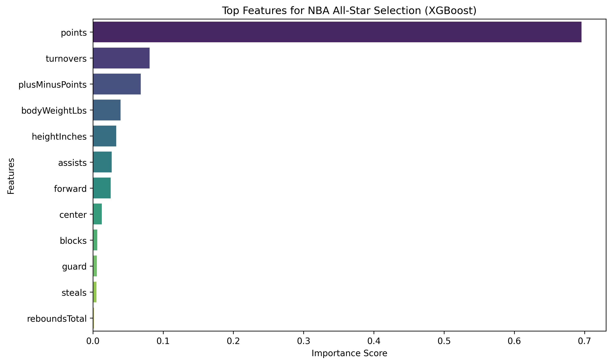

# NBA All-Star Predictor: Can Data Spot Elite Talent? 🏀

I built this project to answer a simple question: **Is there a mathematical "fingerprint" for an All-Star performance?** Most fans look at points per game, but I wanted to go deeper. Using a dataset of over **330,000 individual NBA game records**, I trained a model to look past the hype and identify the core statistics that actually drive elite-level impact on the court.

### 🚀 Live Demo
Test the model with any player stats here: [https://nba-allstar-predictor-fkjtypgiy4cqmrv6cayqsy.streamlit.app/#nba-all-star-performance-predictor]

### 🧠 The "Realism" Challenge
One of the most interesting parts of building this was dealing with "superhuman" inputs. If you input 100 points and 40 rebounds, the model actually gives a lower probability.

**Why?** Because it's trained on reality. In 30+ years of NBA data, those numbers don't exist. I deliberately kept the model grounded—it looks for elite consistency, not "glitch-in-the-matrix" fantasies.

### 🛠️ Engineering Decisions
* **The Model:** I chose XGBoost because it handled the non-linear relationships between a player's physical build and their box score much better.
* **The 25% Threshold:** In a league of 450+ players, All-Stars are the 1%. I set my decision threshold at 25%.
* **Feature Importance:** As seen below, the model places huge value on Plus/Minus and Efficiency.

### 📦 Running it Locally
1. Clone the repository.
2. Install the requirements: `pip install -r requirements.txt`
3. Launch the app: `streamlit run streamlit_app.py`
